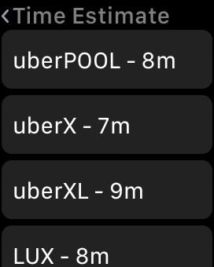
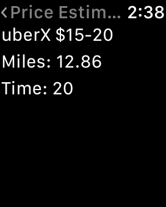

South Florida Xamarin User Group watchOS App Demo
=============

Xamarin watchOS sample app to find Uber time and price estimates.
*******

Screenshots
-------

  

Setup
-------

1. Head to https://developer.uber.com and create an account.
2. Create an Uber app and grab your server token.
3. Edit SFXUGDemo.SFXUGDemoWatchAppExtension/Util.cs and update the token property.
4. Run solution in Xamarin.
